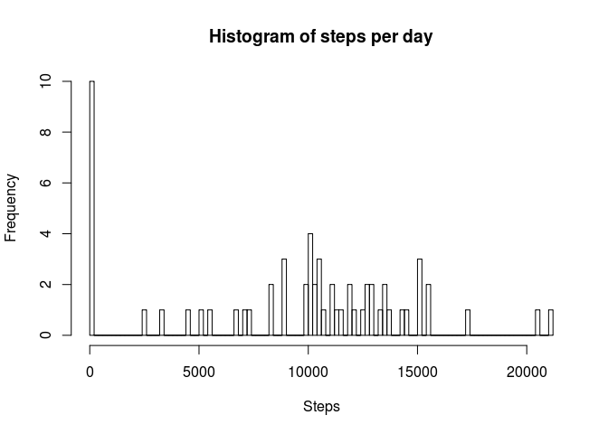
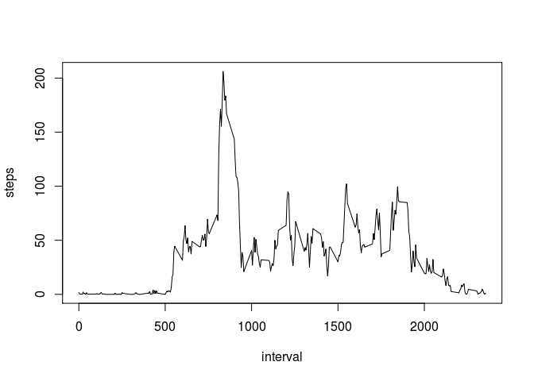
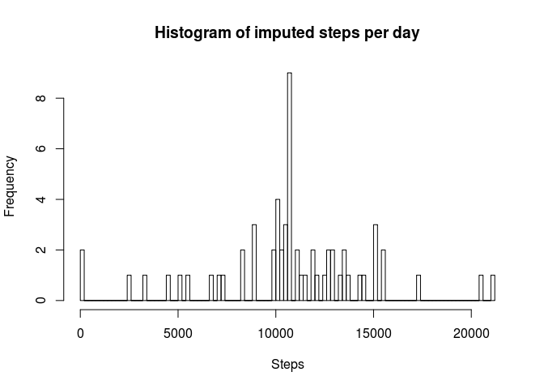
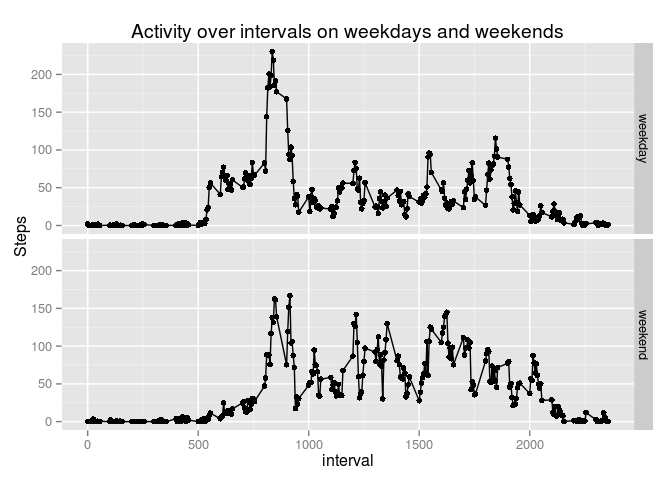

# Reproducible Research: Peer Assessment 1


## Loading and preprocessing the data


```r
library(plyr)
library(data.table)
library(ggplot2)
activity <- read.csv("activity.csv")
activity <- mutate(activity, date = as.Date(date))
```


## What is mean total number of steps taken per day?

```r
daily_activity <- ddply(activity, .(date),summarize,steps_per_day = sum(steps,na.rm=TRUE))
avg_steps_per_day = mean(daily_activity$steps_per_day)
median_steps_per_day = median(daily_activity$steps_per_day)
```


```r
hist(daily_activity$steps_per_day, breaks=100, 
     main="Histogram of steps per day", 
     xlab="Steps")
```

 

The mean number of steps per day is 9354.23
and the median is 10395.

## What is the average daily activity pattern?

```r
# summarize average steps by interval across all days 
interval_activity <- ddply(activity,.(interval),summarize,avg_steps = mean(steps,na.rm=TRUE))
max_avg_steps = max(interval_activity$avg_steps)
interval_with_max_avg_steps = subset(interval_activity, avg_steps == max_avg_steps)$interval
with(interval_activity,plot(interval,avg_steps, type="l", xlab="interval",ylab="steps"))
```

 

The interval with the maximum number of average steps is 835. 


## Imputing missing values

```r
missing_data_count = nrow(subset(activity, is.na(steps)))

# set missing data (steps)  to mean of that interval across all days
activity_join <- join(activity,interval_activity,by="interval", type="inner")
activity_join <- mutate(activity_join, steps = ifelse(is.na(steps), round(avg_steps,0), steps))

imputed_activity = subset(activity_join,select=c("date","steps","interval"))
imputed_daily_activity <- ddply(imputed_activity, .(date),summarize,steps_per_day = sum(steps,na.rm=TRUE))
imputed_avg_steps_per_day = mean(imputed_daily_activity$steps_per_day)
imputed_median_steps_per_day = median(imputed_daily_activity$steps_per_day)
```

The number of rows with missing data is 2304.
Imputting the missing data to the rounded average of mean for that interval across
all days, we can recompute the total steps per day across all days and recompute
their frequencies.


```r
hist(imputed_daily_activity$steps_per_day, breaks=100, 
     main="Histogram of imputed steps per day", 
     xlab="Steps")
```

 

The mean number of imputed steps per day is 10765.64
and the median is 10762.

## Are there differences in activity patterns between weekdays and weekends?

```r
is_weekday <- function(day_of_week){
        ifelse(day_of_week %in% c("Saturday","Sunday"),"weekend","weekday")
}

imputed_activity <- mutate(imputed_activity, day_of_week = factor(weekdays(date)))
imputed_activity <- mutate(imputed_activity, day_type = factor(is_weekday(day_of_week)))

imputed_activity_interval_by_weekday <- ddply(imputed_activity,.(interval,day_type),summarize, avg_steps = mean(steps,na.rm=TRUE))

p <- qplot(interval, avg_steps, data=imputed_activity_interval_by_weekday, facets= day_type ~ ., main="Activity over intervals on weekdays and weekends", ylab="Steps")+geom_line()
print(p)
```

 
